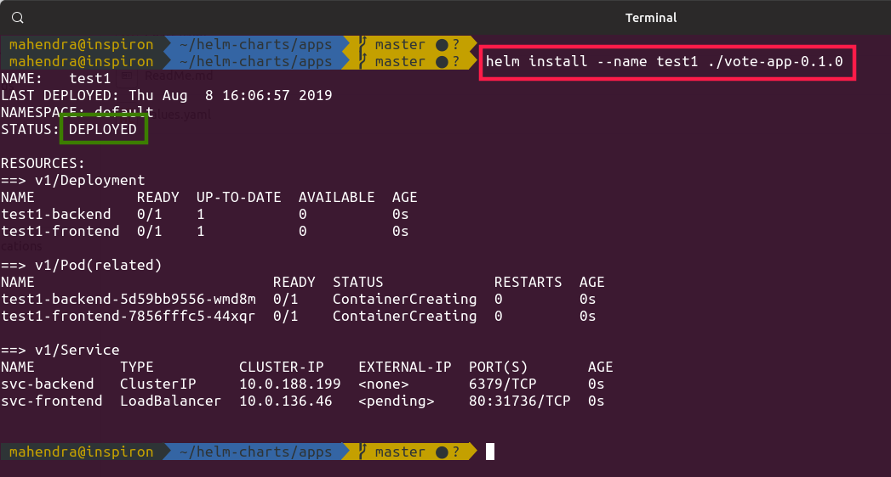
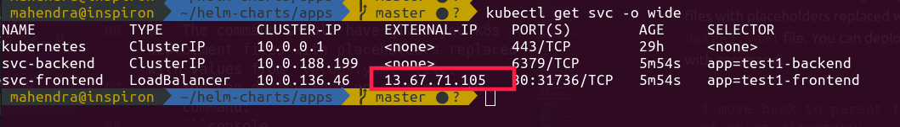
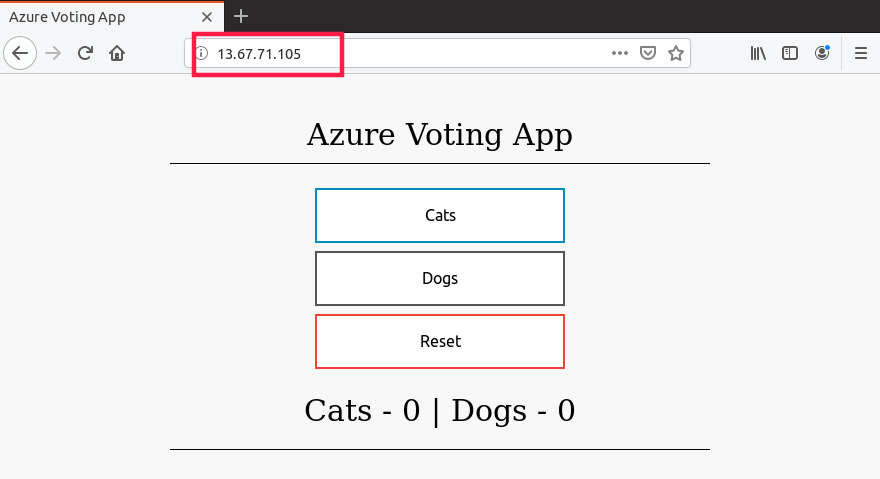

## A Simple Python/Flask based Web Application using redis backend

> This application is based on sample application from azure sample. click [here](https://docs.microsoft.com/en-us/azure/aks/tutorial-kubernetes-deploy-application) for original demo at azure docs. and click [here](https://github.com/Azure-Samples/azure-voting-app-redis) for source code repository.

### Pre-requisites

1.  An AKS cluster with kubectl installed and configured in your local machine.

2.  Helm installed and configured.

3.  Basic understanding of kubernetes & containers.

4.  Smart Text editor like VSCode, atom or Sublime Text3 (I prefer VSCode).

5.  **OPTIONAL** VSCode extensions for Kubernetes.


### The Procedure
1.  Create a new helm chart using following command. After new chart is created, just delete all generated templates.

    ```console
    $ helm create vote-app-0.1.0
    $ cd vote-app-0.1.0/templates
    $ rm -r *
    ```
2.  Now, you need to update the `Chart.yaml` file in root directory `vote-app-0.1.0` 

    ```yaml
    apiVersion: v1
    appVersion: "1.0"
    description: A Helm chart for Vote App (Python+Flask)
    name: vote-app
    version: 0.1.0
    maintainers:
    - name: Mahendra Shinde
      email: MahendraShinde@synergetics-india.com
    ```
    > Get full yaml file [here](Chart.yaml)

3.  You need to create two new files under `templates` directory. 

    3.1. [service.yaml](templates/service.yaml)
    
    3.2. [deployment.yaml](templates/deployment.yaml)

4.  Both these files contain few place-holders writtern within `{{` and `}}` 

    you need to provide the values using `values.yaml` file in root directory.

    just open file `values.yaml` and add following values.

    ```yaml
    replicaCount: 
      frontend: 1
      backend: 1

    ## Define both container images here...
    image:
      backend: redis
      frontend: microsoft/azure-vote-front:v1

    imagePullSecrets: []
    nameOverride: ""
    fullnameOverride: ""

    service:
      type: ClusterIP
      port: 80

    nodeSelector: 
      beta.kubernetes.io/os: linux


    tolerations: []

    affinity: {}
    ```
    > Get full file [here](values.yaml)

5.  Now, that you have your **chart** ready, test it using following command.

    ```console
    $ helm install --dry-run --debug ../vote-app-0.1.0
    ```

6.  The command should have given you k8s deployment files with placeholders replaced with values from `values.yaml` file.
    You can deploy them on cluster with command:
    
    ```console
    # move back to parent folder (parent of chart directory)
    $ cd ..
    # request helm to deploy your chart from child directory (make sure directory exists)
    $ helm install --name ./vote-app-0.1.0
    ```

    Your output should be similar to this.
    


7.  Now, try to get external-ip from the service deployed.

    ```console
    $ kubectl get svc -o wide
    ```

    You should get output like this one:
    

8.  Open your web-browser and try access the IP address from output of previoud command.

    